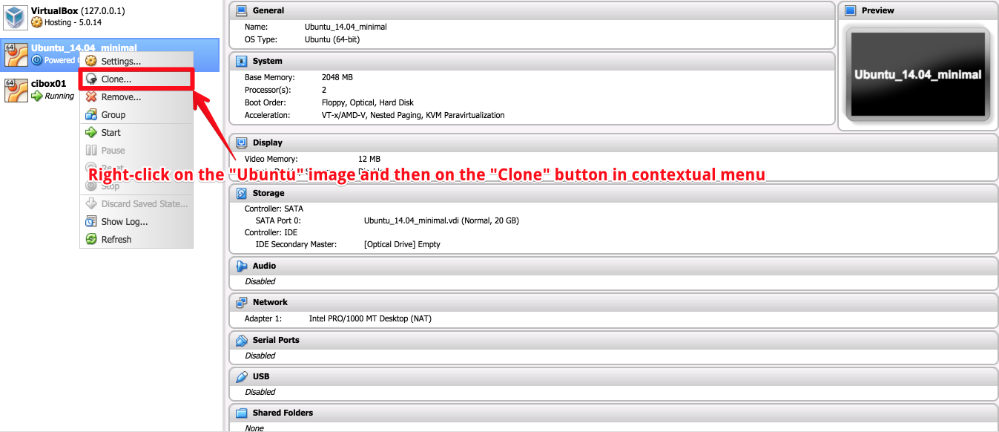
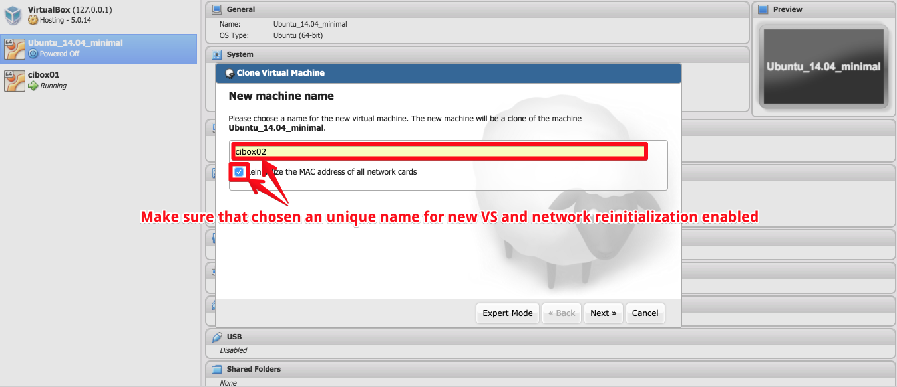
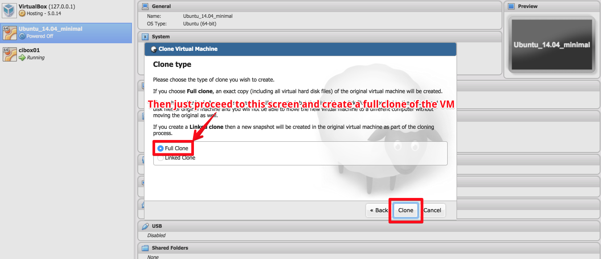
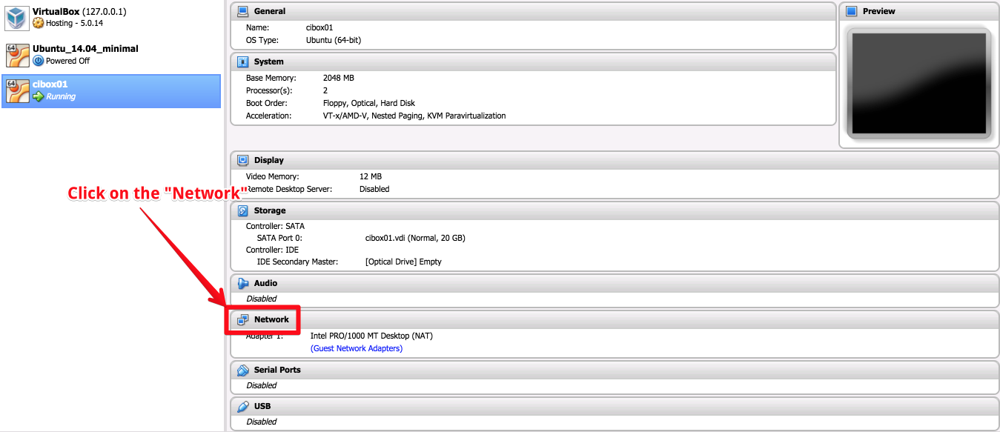
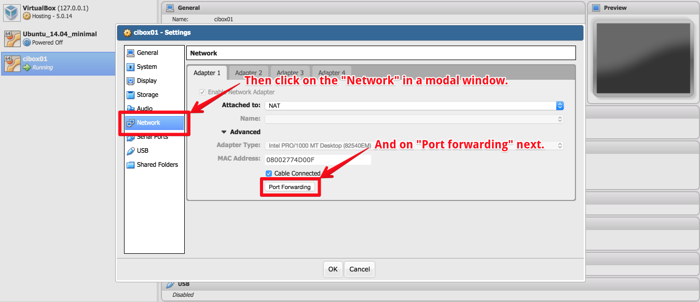
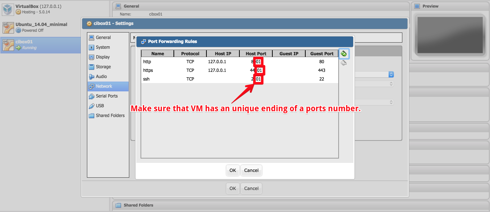

# Matrix

With this tool you able to create own matrix with virtual servers.

Let's describe a structure and technologies. First of all, we need to get acquainted with two basic terms: `host` and `droplet`.

- `host` - is a physical computer (server);
- `droplet` - is a virtual machine, located on the `host`.

As much as needed droplets can be created on a host machine (depending on hardware configuration, of course).

Host machine operates only by minimal set of software:

- VirtualBox
- NGINX
- PHP
- phpVirtualBox

Every droplet has it own private network, which forwarded to a host. For example, you have 10 virtual server. Each of them forwards three ports: `80<NN>`, `443<NN>` and `22<NN>` (`<NN>` - is a serial number of a droplet). NGINX is listening `80<NN>` and `443<NN>` ports on a host and forwards connection inside of droplets. `80<NN>` forwards to 80, `443<NN>` - to 443. `22<NN>` forwards to 22, for SSH connections.

That's all! And that's cool! Every virtual server can be additionally provisioned by main `cibox` tool to convert it to CI server.

## Usage

Add your own host inside of `inventory` file and run the following command:

```shell
./cibox matrix/matrix.yml --limit=<HOSTNAME>
```

## Create new droplet

New droplets can be created using two ways: [Ansible provisioning](#using-ansible) or [UI of phpVirtualBox](#using-ui).

### Using Ansible

```shell
./cibox matrix/matrix.yml --limit=<HOSTNAME> --tags=vm --droplet-add
```

### Using UI








When described above steps are done, then just power on a virtual machine, create a record at [inventory](../inventory#L7-L8) and provision new virtual server with main `cibox` tool.

`phpVirtualBox` will be available on the domain which you have to [configure](matrix.yml#L5). Imagine that it is: `m2.propeople.com.ua`. As you can see on the screenshots, every port ends by `01`. This means that domain for VM will be `cibox01.propeople.com.ua`.

Why `cibox<NN>`? [Look there](matrix.yml#L6) for the answer.

## To do

- Allow to use not self-signed SSL certificates
- Use OS image from ubuntu servers and configure it programmatically
- Allow to add SSH keys to a droplet on creation stage
